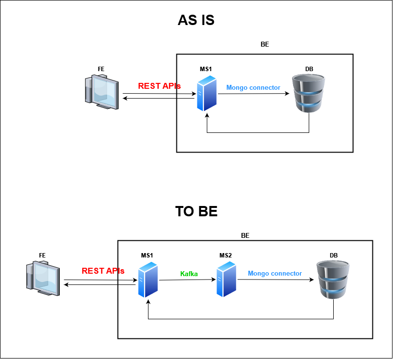
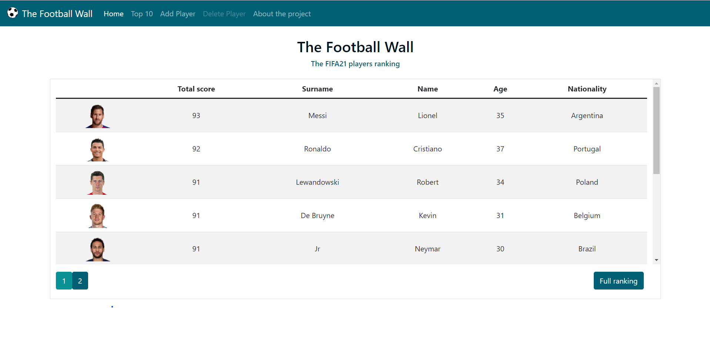
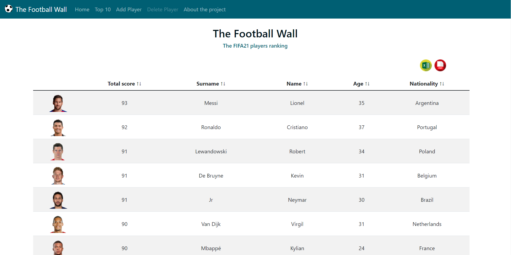
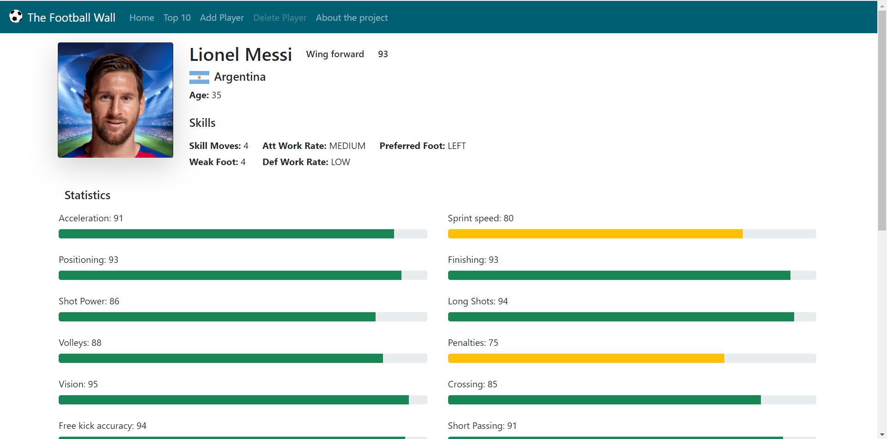
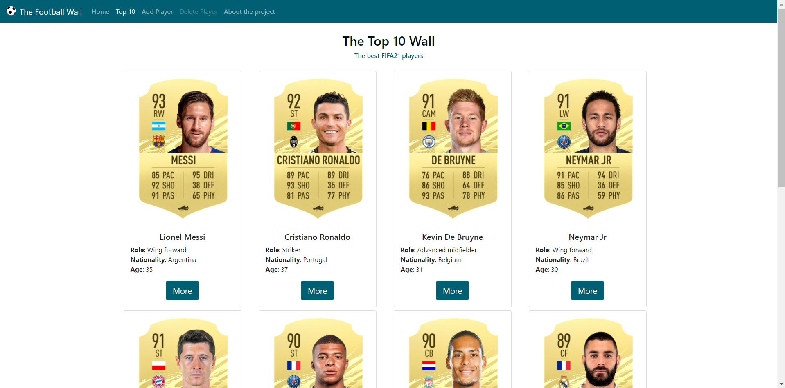
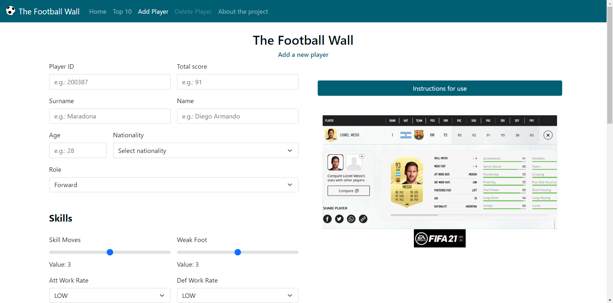

# The Football Wall :soccer: <!-- omit in toc -->
The Football Wall is a full-stack project I made to learn or better understand some technologies: various of them are involved in this project:
* **Back-end:**
    * Java:
        * Spring Boot
        * MVC Pattern
        * Builder pattern
        * OpenAPI 3.0 and Swagger
        * Lombok
        * SLF4J and Logback
        * Kafka (**to be**)
    * Database:
        * _SQL_: Oracle (**to be**)
        * _NO SQL_: MongoDB
* **Front-end:**
    * HTML5
    * CSS3
        * Bootstrap
    * Javascript
        * Javascript Vanilla
        * ReactJS (**to be**)
        * Axios
  
  <br>
  <strong><a href="https://thefootballwall.herokuapp.com/" target="_blank">Watch the project!</a></strong>


<br>
## Project description
**The Football Wall** was born from the desire to put together different technologies, in order to invole myself in a full-stack development that would allow me to learn as much as possible.  
I was looking for an idea to start the project, but my little immagination blocked me for a couple of days: I thought that an idea was absolutely necessary before start a work, because without a clear idea I would not have known where to end up.  
After many hours of thinking and after some Google searches I found a page that gave me the inspiration to start. This page is the EA Sports Fifa 21 rating database ([you can see it by clicking here](https://www.ea.com/en-gb/games/fifa/fifa-21/ratings/ratings-database)).  
So, starting from this page, I decided to build a web app that could show some data to the users, retrieving them from a database, using some rest APIs.  
The EA Sports pages give me the inspiration for the data to use, in fact The Football Wall will use the information about football players contained in the aforementioned site.  
All information are "manually" inserted in the DB of this web app and not retrieved directly from the EA Sports page.
Actually the software structure foresees the presence of a front-end that interfaces with the back-end through REST APIs.  
The back-end exposes some functionality that communicate with MongoDB to make the CRUD operations and to do this are used the Mongo connectors.  
In a near future I would like to include Kafka, <u>for purely educational purposes</u>, to try the communication between two microservices and the communication from front-end to DB will be done passing by two microservices in which only one of them has directly connection to Mongo.  
<p align="center">
  
</p>
As you can see in the schemas above, in the TO BE schema the only purpose of MS2 is to communicate with Mongo in writing mode and MS1 communicate with MS2 via Kafka and in reading mode with DB.  
This could appear as a non-sense schema, but as I said before, Kafka will be used only for learning and this connection appears as a good way to make some tests.


<br>
## Back-end
### APIs
As already mentioned in the previous paragraph, the information relating to a player is kept within a MongoDB database and is accessed, entered or manipulated through REST APIs.  

Method  | API Path             | Description
------- | ---------------------| -------------------------
GET     | `/api/getplayer/all` | Get a list of all football players and their skills
GET     | `/api/getplayer/all/paginated` | Get a paginated list of all football players and their skills 
GET     | `/getplayer/topten`  | Get the list of first ten players, ordered by total score
GET     | `/api/getplayer`     | Get data about the spcified football player and his skills. The usable parameters are `surname` and `name`. The parameters are case insensitive.
GET     | `/getplayer/{playerId}` | Get the data about the player specified by his playerId.
POST    | `/api/addplayer`     | Add new player

<strong><a href="https://thefootballwall.herokuapp.com/try-api.html" target="_blank">Try the APIs</a></strong>


### Logs
The logs are sored under a folder called Logs in which you'll find a daily file (tfw-BE.log) and a series of compressed (gz) files.  
The logging policy store files for a max-size of 1MB.  
  
If you need to search from log, you can use the bash commands `grep` (for *.log files) and `zgrep` (for *.gz compressed files) to do it.  

The logs will be stored for one week and over this time will be automatically deleted.

#### Example of log search  
To search on today logs:
```Shell
clear; grep <string_to_retrieve> ./tfw-BE.log
```
To search on archived logs (change the date to get the right logs):
```Shell
clear; zgrep <string_to_retrieve> ./*2022-02-17*.gz 
```  

<br>
## Front-end
The front-end was developed using the "old school" tools: HTML5, CSS3 and JavaScript Vanilla.  
Why I used JavaScript vanilla? Because I didn't know well this programming languagge: I've use it often but with but with a superficial knowledge of it. So I decided to build this project starting from primordial style of coding. It wouldn't have made sense to use more modern frameworks like Angular or React without a good knowledge of JavaScript.  

### The FE structure
The front-end has a structure that allows the user to read or insert data about football players and it's build by using some REST calls that retrieve data from MongoDB and shows them in the browser.  
The home page contains a paginated table with the ranking of the players, ordered by descending total score.
<p align="center">
  
</p>
Each page of the table shows a maximum of 10 players. By clicking on the page number buttons, another page will be shown and by an API call the page will be builded.  
To get a non-paginated table, the user can click on the "Full ranking" button, on the lower right corner of the table: the click on this button will redirect the user to another page in which a table will be builded dynamically retrieving data from db.  
<p align="center">
  
</p>
This table has the possibility to get a custom order that the user can choose. This ordering is implemented in a static way: the table is build by a REST API call and once it was created the data inside the table rows can be manipulated with an alghorithm (<a href="https://www.w3schools.com/howto/howto_js_sort_table.asp" target="blank">click here</a> to see the algorithm used) that allows the user to choose the order of table.  
  
When you click on a table row, you choose to see more information about the player associated to the row and a page will be opened and dynamically builded. This page will builded by a REST API get call and shows the data about the selected player:
<p align="center">
  
</p>  
Another page you can see is the Top Ten page that shows the list of the first 10 best players, ordered by their total score:
<p align="center">
  
</p>
By clicking on the "more" button, a modal, similar to the previously viewed page, will be shown.  
The user has the possibility to add a player by using the page Add Player.
In this case a POST call will used to do the adding of the player to our db.
<p align="center">
  
</p>  

<br>
## The environment
In order to develop this project, I decided to use two environments. In this way, the development phase was divided from the deployment phase and this structure allows to manage in a better way the data stored into development database and production database.  
The mechanism to do this uses the Spring Boot profiles.

### Development Environment
The development of this platform was performed using different tools for front-end and back-end. The front-end part was developed using VSCode, instead the back-end using Eclipse.  
Before merging under unique build path the front-end and the back-end, I used the Live Server plugin of VSCode to allow the code to run. This plugin create a web server and exposes it by default on the port 5500 of 127.0.0.1 so in odrer to make in communication the front-end with the back-end and allows the front-end to call the APIs, each api on the back-end was annotated with the Spring annotation
```Java
@CrossOrigin(origins = "http://127.0.0.1:5500")
```
which specifies the address of the api users.  
To use the db, I used an instance of MongoDB by creating a Docker container and I used it on localhost:27017.

### Production Environment
The web-app was deployed using <strong>Heroku</strong>, and you can try it by <a href="https://thefootballwall.heroku.com" target="blank">clicking here</a>.  
In this case, the data was stored on a "production DB" that is hosted on the <strong>Atlas</strong> cloud (the official MongoDB cloud).  
In order to divide production from development environments, I used the Spring Boot profiles and for the production environment I used some Env Variables configured on Heroku dashboard.  
The Deploy is automatically triggered when a push on the branch master of this GitHub repo will be thrown.      
<br>

## Possible future additions
In the future I think to integrate this web app with other technologies that will allow me to learn other things, like the integration of SQL in Spring Boot.  
The technologies I would like to integrate are: 
* Apache Kafka
* Oracle SQL
* Hibernate
* ReactJS (with a refactor of the front-end part from pure JS to React)  
In the future I think to "dockerize" the web app, in order to allow the users to try and run it in a local container.  
This is a simple project without a real functional purpose, however introducing Docker is an additional feature to add to the set of technologies involved. 

<br>    
<br>
<strong><a href="https://thefootballwall.herokuapp.com/" target="_blank">Watch the project!</a></strong>

<br>    
<br>
<p style="font-size: 10px"><strong>*NOTE:</strong> the Heroku free plan provides that after a certain time of inactivity the server goes into a state of freezing. Don't worry if the page will not be reachable immediately: at the first access after the freezing the server will take a few seconds to start.</p>
